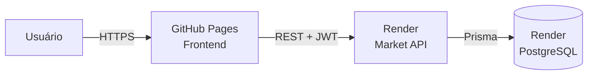

# Market API

Backend publicado do Mercatto, um sistema de gestão para pequenos mercados. A
API centraliza autenticação, catálogo, categorias, estoque, vendas e
cancelamentos.

## Sistema publicado

| Recurso            | Endereço                                               |
| ------------------ | ------------------------------------------------------ |
| Frontend           | <https://saneromachado.github.io/mercatto-market-web/> |
| Saúde da API       | <https://market-api-njmw.onrender.com/api/health>      |
| Swagger            | <https://market-api-njmw.onrender.com/docs>            |
| Código do frontend | <https://github.com/saneromachado/mercatto-market-web> |
| Código da API      | <https://github.com/saneromachado/market-api>          |

A base REST usada pelo frontend é:

```text
https://market-api-njmw.onrender.com/api
```

Essa base não possui uma página visual. Para verificar a publicação, use a rota
de saúde ou o Swagger.

## Arquitetura



- O GitHub Pages entrega o frontend estático.
- O Render executa a API Node.js/NestJS.
- O PostgreSQL do Render armazena os dados.
- O Prisma aplica migrations e acessa o banco.
- O JWT protege as rotas autenticadas.
- O CORS permite requisições dos frontends publicados.

## Funcionalidades disponíveis

- autenticação com JWT;
- cadastro, consulta, atualização, substituição e inativação de categorias;
- cadastro, pesquisa, alteração e inativação de produtos;
- entradas, saídas e ajustes de estoque;
- histórico de movimentações;
- alertas de estoque baixo;
- vendas com um ou vários produtos;
- validação de estoque disponível;
- cancelamento de vendas com devolução ao estoque;
- proteção contra cancelamento duplicado;
- respostas de erro padronizadas;
- documentação Swagger/OpenAPI.

### Endpoints de categorias

| Método   | Rota                   | Comportamento                        |
| -------- | ---------------------- | ------------------------------------ |
| `POST`   | `/api/categories`      | Cadastra uma categoria               |
| `GET`    | `/api/categories`      | Lista as categorias                  |
| `GET`    | `/api/categories/{id}` | Consulta uma categoria               |
| `PATCH`  | `/api/categories/{id}` | Atualiza parcialmente                |
| `PUT`    | `/api/categories/{id}` | Substitui todos os campos editáveis  |
| `DELETE` | `/api/categories/{id}` | Inativa a categoria (`active=false`) |

O `DELETE` é lógico para preservar os produtos relacionados à categoria.

## Tecnologias publicadas

- Node.js 22;
- NestJS e TypeScript;
- PostgreSQL no Render;
- Prisma ORM;
- Swagger/OpenAPI;
- Render Blueprint;
- GitHub.

Docker não faz parte do ambiente publicado. O backend usa o runtime Node.js e o
PostgreSQL gerenciado pelo Render.

## Acesso ao sistema

O usuário administrador de produção usa:

```text
E-mail: admin@market.local
Senha: valor secreto de ADMIN_PASSWORD no Render
```

O usuário somente leitura usa:

```text
E-mail: consulta@market.local
Senha: Viewerpassword
```

O perfil `VIEWER` pode abrir o painel e consultar produtos, categorias, estoque e
vendas. A API bloqueia criação, alteração, exclusão, movimentação de estoque,
finalização e cancelamento de vendas.

A senha não fica armazenada no GitHub. Para redefini-la:

1. abra o serviço `market-api` no Render;
2. acesse **Environment**;
3. altere `ADMIN_PASSWORD` para uma senha com pelo menos oito caracteres;
4. salve a alteração;
5. execute **Manual Deploy > Deploy latest commit**.

## Publicação no Render

O arquivo [`render.yaml`](render.yaml) gerencia dois recursos na região de Ohio:

- `market-api`: serviço web Node.js;
- `market-db`: banco PostgreSQL.

O build de produção:

1. instala as dependências;
2. gera o cliente Prisma;
3. compila o NestJS.

Na inicialização, a aplicação:

1. aplica as migrations pendentes;
2. executa o seed do administrador;
3. inicia a API em `0.0.0.0` usando a porta fornecida pelo Render.

Se uma atualização não iniciar automaticamente, use **Manual Deploy > Deploy
latest commit** no serviço `market-api`.

## Variáveis de produção

| Variável          | Responsabilidade                         |
| ----------------- | ---------------------------------------- |
| `DATABASE_URL`    | Conexão interna com o PostgreSQL         |
| `JWT_SECRET`      | Assinatura dos tokens JWT                |
| `JWT_EXPIRES_IN`  | Validade dos tokens                      |
| `FRONTEND_URL`    | Origens adicionais autorizadas pelo CORS |
| `ADMIN_NAME`      | Nome do administrador inicial            |
| `ADMIN_EMAIL`     | E-mail do administrador inicial          |
| `ADMIN_PASSWORD`  | Senha secreta do administrador           |
| `VIEWER_NAME`     | Nome do usuário de consulta              |
| `VIEWER_EMAIL`    | E-mail do usuário de consulta            |
| `VIEWER_PASSWORD` | Senha pública do usuário de consulta     |

As origens de frontend autorizadas são:

```text
https://saneromachado.github.io
https://mercatto-market-web.sanerdark.chatgpt.site
```

## Verificação da publicação

O endpoint abaixo deve retornar `status: ok`:

```text
GET https://market-api-njmw.onrender.com/api/health
```

Exemplo de resposta:

```json
{
  "status": "ok",
  "service": "market-api",
  "timestamp": "2026-07-31T12:45:19.303Z"
}
```

O valor de `timestamp` muda em cada requisição.

## Problemas comuns em produção

### `Cannot GET /`

A raiz do domínio do Render não possui página visual. Use `/api/health` ou
`/docs`.

### `Failed to fetch`

Normalmente significa que o último deploy da API ainda não terminou, que a
instância está despertando ou que o CORS não autorizou o domínio do frontend.

### Login retorna `401`

Confirme o e-mail de produção e redefina `ADMIN_PASSWORD` no Render. Depois faça
um novo deploy.

### A API demora para responder

O plano gratuito pode suspender a instância após inatividade. A primeira
requisição pode demorar enquanto o serviço reinicia.

## Documentação completa

Consulte [`docs/INTEGRACAO.md`](docs/INTEGRACAO.md) para detalhes sobre:

- fluxo completo entre navegador, frontend, API e banco;
- autenticação JWT;
- CORS;
- variáveis de ambiente;
- deploy do Render e do GitHub Pages;
- checklist e diagnósticos.
