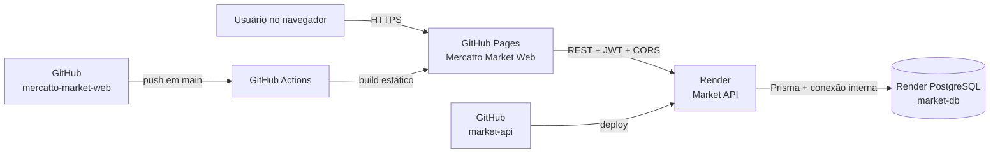
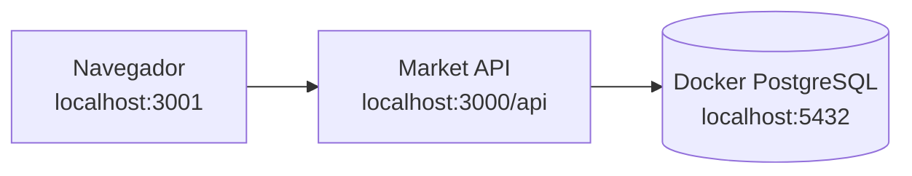

# Integração do Mercatto

Este documento descreve como o frontend, a API e o banco de dados do Mercatto
se conectam nos ambientes local e publicado. Ele também registra o processo de
deploy, as variáveis de ambiente e os diagnósticos mais comuns.

## Arquitetura publicada



| Componente         | Tecnologia           | Endereço ou repositório                                |
| ------------------ | -------------------- | ------------------------------------------------------ |
| Frontend           | Next.js estático     | <https://saneromachado.github.io/mercatto-market-web/> |
| Código do frontend | GitHub               | <https://github.com/saneromachado/mercatto-market-web> |
| Base REST da API   | NestJS no Render     | <https://market-api-njmw.onrender.com/api>             |
| Saúde da API       | Render               | <https://market-api-njmw.onrender.com/api/health>      |
| Swagger            | Render               | <https://market-api-njmw.onrender.com/docs>            |
| Código da API      | GitHub               | <https://github.com/saneromachado/market-api>          |
| Banco              | PostgreSQL no Render | Acesso interno pela variável `DATABASE_URL`            |

O frontend publicado anteriormente no Sites continua autorizado no CORS em
`https://mercatto-market-web.sanerdark.chatgpt.site`, mas o endereço principal
documentado é o GitHub Pages.

## Como uma requisição percorre o sistema

1. O navegador baixa HTML, CSS e JavaScript do GitHub Pages.
2. O frontend usa `NEXT_PUBLIC_API_URL` para chamar a API por HTTPS.
3. No login, o frontend envia e-mail e senha para `POST /api/auth/login`.
4. A API consulta o usuário no PostgreSQL e compara a senha com o hash salvo.
5. A API devolve um JWT quando as credenciais são válidas.
6. O frontend guarda o JWT no navegador e o envia como
   `Authorization: Bearer <token>` nas rotas protegidas.
7. A API valida o JWT, executa as regras de negócio e acessa o banco pelo
   Prisma.

O e-mail inicial é `admin@market.local`. Em produção, a senha é o valor secreto
de `ADMIN_PASSWORD` configurado no Render. A senha local padrão `admin123` não
deve ser usada em produção.

## CORS

Frontend e backend usam domínios diferentes. Por isso, o navegador exige que a
API autorize explicitamente a origem do frontend.

Origens de produção autorizadas:

```text
https://saneromachado.github.io
https://mercatto-market-web.sanerdark.chatgpt.site
```

O CORS usa apenas a origem, sem o caminho `/mercatto-market-web`. Se a API não
autorizar a origem, o navegador mostra `Failed to fetch`, mesmo que a API esteja
online.

Para validar manualmente:

```powershell
curl.exe -i -X OPTIONS `
  -H "Origin: https://saneromachado.github.io" `
  -H "Access-Control-Request-Method: POST" `
  -H "Access-Control-Request-Headers: content-type" `
  https://market-api-njmw.onrender.com/api/auth/login
```

A resposta esperada é `204 No Content` com:

```text
access-control-allow-origin: https://saneromachado.github.io
```

## Variáveis da API no Render

| Variável         | Origem             | Finalidade                                    |
| ---------------- | ------------------ | --------------------------------------------- |
| `NODE_ENV`       | `render.yaml`      | Ativa o modo de produção                      |
| `NODE_VERSION`   | `render.yaml`      | Define a versão do Node.js usada no build     |
| `DATABASE_URL`   | `market-db`        | Conexão interna com o PostgreSQL              |
| `JWT_SECRET`     | Gerada pelo Render | Assina e valida tokens JWT                    |
| `JWT_EXPIRES_IN` | `render.yaml`      | Tempo de validade do token                    |
| `FRONTEND_URL`   | `render.yaml`      | Lista adicional de origens permitidas no CORS |
| `ADMIN_NAME`     | `render.yaml`      | Nome do administrador inicial                 |
| `ADMIN_EMAIL`    | `render.yaml`      | E-mail do administrador inicial               |
| `ADMIN_PASSWORD` | Segredo manual     | Senha do administrador inicial                |

`ADMIN_PASSWORD` deve ter pelo menos oito caracteres. O seed de produção é
executado na inicialização e mantém o administrador ativo com a senha definida
nessa variável.

## Variáveis do frontend

O GitHub Actions define a variável pública durante o build:

```env
NEXT_PUBLIC_API_URL=https://market-api-njmw.onrender.com/api
```

O build também define `GITHUB_PAGES=true`. Com isso, `next.config.ts`:

- gera uma exportação estática em `out/`;
- adiciona o caminho base `/mercatto-market-web` aos recursos;
- gera URLs compatíveis com o endereço do repositório no GitHub Pages.

Nenhuma senha ou segredo deve ser colocado no frontend. Variáveis com prefixo
`NEXT_PUBLIC_` ficam visíveis no JavaScript entregue ao navegador.

## Deploy do backend

O arquivo `render.yaml` descreve dois recursos:

- `market-api`: serviço web Node.js;
- `market-db`: PostgreSQL.

O build executa:

```text
npm ci --include=dev
npm run prisma:generate
npm run build
```

Na inicialização, `npm run start:prod`:

1. aplica as migrations com `prisma migrate deploy`;
2. executa o seed;
3. inicia `dist/src/main.js`.

Depois de enviar uma mudança para `main`, acompanhe o serviço no Render. Se o
deploy automático não começar, use **Manual Deploy > Deploy latest commit**.

## Deploy do frontend

O workflow `.github/workflows/deploy-pages.yml` é acionado por push em `main` ou
manualmente pela aba **Actions**. Ele:

1. instala as dependências com `npm ci`;
2. executa typecheck e lint;
3. executa `npm run build:pages`;
4. envia o diretório `out/` ao GitHub Pages;
5. publica o resultado no endereço de produção.

O GitHub Pages deve estar configurado com **Source: GitHub Actions** nas
configurações do repositório.

## Ambiente local



### Backend

```powershell
cd C:\Users\saner.machado\Documents\PlaywrightDemo\market-api
npm install
docker compose up -d
npm run setup
npm run start:dev
```

### Frontend

Em outro PowerShell:

```powershell
cd C:\Users\saner.machado\Documents\PlaywrightDemo\market-web
Copy-Item .env.example .env.local
npm install
$env:PORT = "3001"
npm run dev
```

Endereços locais:

| Serviço    | Endereço                     |
| ---------- | ---------------------------- |
| Frontend   | <http://localhost:3001>      |
| API        | <http://localhost:3000/api>  |
| Swagger    | <http://localhost:3000/docs> |
| PostgreSQL | `localhost:5432`             |

## Checklist após uma publicação

1. Abra `/api/health` e confirme `status: ok`.
2. Confirme que o deploy do GitHub Actions terminou com sucesso.
3. Abra o GitHub Pages com `Ctrl + F5` para evitar arquivos antigos em cache.
4. Faça login com `admin@market.local` e a senha de produção.
5. Confirme que produtos, estoque e vendas carregam.
6. Teste ao menos uma operação sem usar dados importantes.

## Solução de problemas

### `Cannot GET /`

A raiz do domínio do Render não possui uma página. Isso não indica falha da
API. Use `/api/health` para saúde ou `/docs` para o Swagger.

### `Failed to fetch`

Verifique, nesta ordem:

1. se `/api/health` responde;
2. se o Render terminou o deploy do último commit;
3. se o cabeçalho CORS autoriza `https://saneromachado.github.io`;
4. se a URL configurada no frontend termina em `/api`;
5. se o navegador ainda possui uma URL antiga no armazenamento local.

### O Render demora para responder

Instâncias gratuitas podem suspender por inatividade. A primeira requisição
após esse período pode demorar. Aguarde e tente novamente antes de concluir que
o deploy falhou.

### Login retorna `401`

- Local: execute `npm run db:seed` e use `admin123`.
- Produção: confira `ADMIN_EMAIL` e redefina `ADMIN_PASSWORD` no serviço do
  Render. Depois salve e faça um novo deploy.

### GitHub Pages retorna `404`

Confira se:

- o workflow terminou com sucesso;
- o Pages usa **GitHub Actions** como fonte;
- o `basePath` é `/mercatto-market-web`;
- a URL termina com `/mercatto-market-web/`.

## Segurança e operação

- Nunca envie `.env`, `DATABASE_URL`, `JWT_SECRET` ou `ADMIN_PASSWORD` ao Git.
- Use uma senha de produção diferente de `admin123`.
- Trate o banco gratuito como ambiente de estudo ou demonstração.
- Faça backups antes de armazenar dados importantes.
- Revise os limites atuais dos planos do Render antes de uso comercial.
- Ao trocar o domínio do frontend, atualize o CORS e publique novamente a API.
